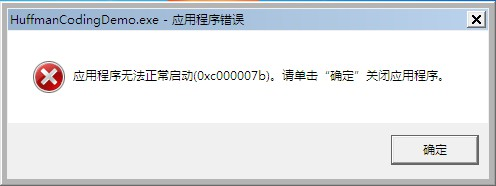

# HuffmanCodingDemo

这是《多媒体计算机技术》所开设的作业。主要是通过 Huffman 树实现对二进制文件或字符串进行压缩处理从而得到相应的压缩文件或者压缩数据。

## 特性

- 多文件压缩，单文件解压缩
- 文本形式压缩与解压缩
- 使用自实现的 HUF 压缩文件数据结构
- 自实现的 HuffmanCodingCore 库提供了对 HUF 数据流的写入和读取的 API，方便开发者调用以二次开发

## 界面

## 开发环境

- Visual Studio 2019
- .NET Framework 4.6

## 编译版本

编译后的版本可以在当前目录下的 build 文件夹下找到

### 运行出错问题汇总

#### 缺少 DirectX

如果目标机器平台上缺少 DirectX，可能会弹出以下错误提示：

获取解决方案请自行使用搜索引擎

#### 缺少 .NET 4.6

如果目标机器平台上缺少 .NET 4.6，可能会弹出以下错误提示：

推荐的解决方案是使用微软官方提供的 .NET 4.6 在线安装器：[下载地址](https://www.microsoft.com/zh-CN/download/details.aspx?id=48130)
